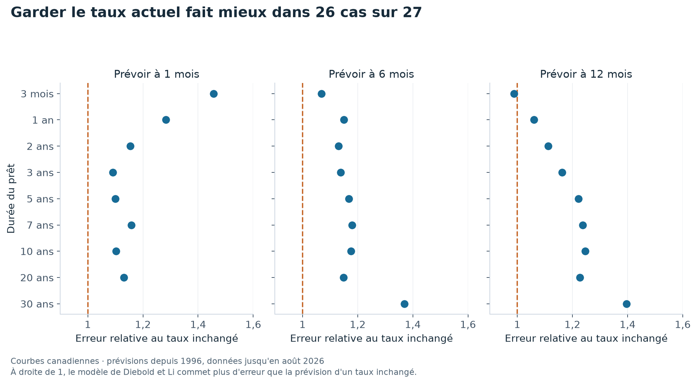

# Les taux d'intérêt d'aujourd'hui aident-ils à prévoir demain ?

Prêter de l'argent pendant trois mois ou pendant dix ans ne rapporte pas le même taux. La courbe des taux rassemble ces taux selon la durée du prêt.

Sa forme peut donner des indices sur l'avenir. Ce projet vérifie ce qu'ils valent au Canada en comparant des prévisions faites avec les seules observations passées.

**Pour prévoir les taux, garder le taux actuel fait mieux que le modèle étudié dans 26 comparaisons sur 27.**

## Une prévision simple comme point de comparaison

Le modèle de Diebold et Li résume la courbe par son niveau, sa pente et sa courbure, puis prévoit l'évolution de ces trois éléments. Il est comparé à une règle qui annonce simplement le taux d'aujourd'hui pour la date future.



La ligne à 1 représente une égalité. Au-dessus, le modèle se trompe davantage que la règle simple. Chaque panneau correspond au délai avant la date prévue.

| Taux à prévoir | Dans un mois | Dans six mois | Dans un an |
|---|---:|---:|---:|
| Prêt à trois mois | 1,456 | 1,068 | 0,988 |
| Prêt à cinq ans | 1,100 | 1,168 | 1,222 |
| Prêt à dix ans | 1,102 | 1,176 | 1,246 |

Par exemple, 1,246 signifie une erreur environ 25 % plus grande. Le test commence en 1996 et utilise les courbes disponibles jusqu'en août 2026. La petite victoire à 0,988 ne se distingue pas du hasard au test employé. [Les 27 comparaisons](results/tables/rmse_prevision.csv).

## Deux autres usages de la même courbe

Le dépôt teste aussi l'idée qu'un taux court supérieur au taux long annonce une récession. Sur les mois gardés pour l'évaluation, le score de classement est de 0,50, le niveau du hasard. Le très petit nombre de récessions empêche d'en tirer une règle générale.

Enfin, il applique des hausses de taux à un bilan bancaire fictif de 100 milliards de dollars canadiens. La perte dépend des échéances qui montent, pas seulement de la plus forte hausse. Un [classeur obligataire](reports/calculs_obligataires.xlsx) permet de modifier les hypothèses.

## Ce que le résultat permet de dire

Ce modèle précis n'améliore pas les prévisions sur cet échantillon canadien. Cela ne prouve ni que tous les modèles de taux échouent, ni que les taux ne contiennent aucune information économique. Le bilan bancaire est construit pour l'exercice et ne représente aucune banque réelle.

## Refaire les calculs

```bash
uv sync --locked --all-extras
uv run pytest
uv run ycc fetch
uv run ycc factors
uv run ycc forecast
uv run ycc recession
uv run ycc alm
```

Les commandes de téléchargement accèdent aux sources externes. Les résultats publiés restent consultables sans lancer les calculs. Le graphique de présentation se régénère hors réseau avec `uv run python scripts/figure_presentation.py`, depuis les tableaux publiés.

## Pour aller plus loin

[Méthodes, résultats complets et références](docs/ETUDE_DETAILLEE.md) · [Présentation en PDF](rapport/rapport.pdf) · [Citer le projet](CITATION.cff) · [Licence](LICENSE).

## English summary

A three-factor yield-curve model loses to unchanged-rate forecasts in 26 of 27 Canadian comparisons. Separate exercises examine recession signals and interest-rate losses on a hypothetical bank balance sheet.
